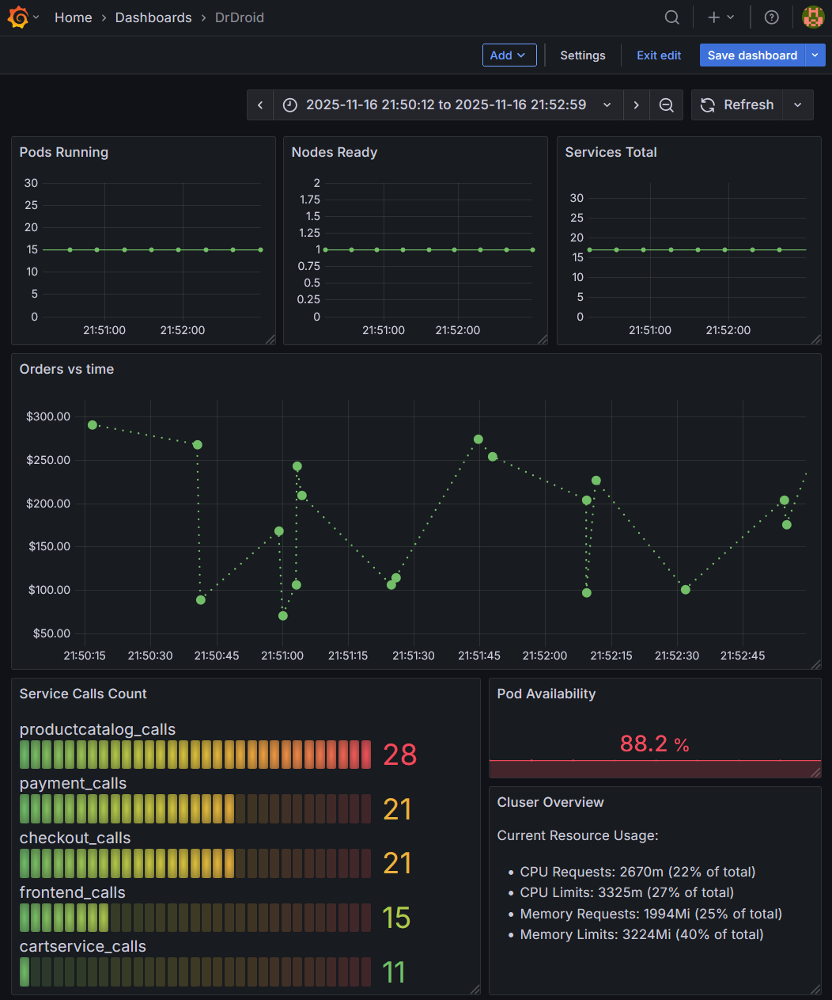

# Dr Droid - Microservices Demo with Kubernetes & Observability

A complete implementation of Google's microservices-demo deployed on Kubernetes with traffic simulation, metrics collection, and visualization in Grafana.



## Project Overview

This project demonstrates:
- ✅ **Kubernetes Deployment**: 12+ microservices running on Minikube
- ✅ **Traffic Simulation**: Locust generating realistic user load
- ✅ **Metrics Collection**: Automated Kubernetes cluster health monitoring
- ✅ **Data Persistence**: PostgreSQL storing orders and metrics
- ✅ **Observability**: Grafana dashboards visualizing all data
- ✅ **Order Processing**: Full e-commerce workflow with database persistence

## Architecture

```
Locust (Traffic Generator)
    ↓
Frontend Service (Minikube)
    ├── Cart Service
    ├── Order Service (saves to PostgreSQL)
    ├── Payment Service
    ├── Product Catalog
    └── ... (12 microservices total)
    ↓
PostgreSQL Database
    ├── orders table (generated by Locust)
    ├── metrics table (collected by cluster_metrics.py)
    ↓
Grafana Dashboard
    (Visualizes orders, metrics, and service activity)
```

## Files & Components

### Infrastructure (YAML)

**postgres-deployment.yaml**
- StatefulSet deployment of PostgreSQL
- Creates `logs` database with orders and metrics tables
- Persistent volume for data storage
- Initialization job to set up schema

**grafana-deployment.yaml**
- Grafana instance for dashboard visualization
- Default credentials: admin/admin
- PostgreSQL datasource pre-configured

**openobserve-deployment.yaml**
- OpenObserve APM tool (optional, for future expansion)
- Supports OTLP metrics/logs/traces

### Scripts

**run_all.py**
- Master orchestration script
- Clears database tables before each run
- Launches Locust and cluster_metrics.py in parallel
- Runs for exactly 3 minutes
- Auto-exits after completion

**locustfile.py**
- Locust load testing script
- Simulates 10 concurrent users
- User behaviors:
  - Browse products (1 call per wait cycle)
  - View product details (2 calls per wait cycle)
  - Add to cart (1 call per wait cycle)
  - Checkout (1 call per wait cycle)
- Creates orders in PostgreSQL for each checkout
- Logs service calls to metrics table (frontend_calls, cartservice_calls, etc.)

**cluster_metrics.py**
- Kubernetes metrics collector
- Runs for 3 minutes, collecting every 20 seconds
- Metrics collected:
  - `pods_running` / `pods_total` - Pod availability
  - `nodes_ready` / `nodes_total` - Node health
  - `services_total` - Total services deployed
  - `pod_availability_percent` - Business KPI
  - `node_availability_percent` - Business KPI

### Database

**microservices_demo.sql**
- Database dump with all simulation data
- Contains:
  - Order records from Locust simulation
  - Kubernetes metrics time-series data
  - Service call frequency logs
- Can be restored with: `psql -U postgres logs < microservices_demo.sql`

## Getting Started

### Prerequisites
- Minikube (Kubernetes cluster)
- Docker Desktop
- Python 3.8+
- kubectl
- PostgreSQL client tools
- Grafana (deployed via postgres-deployment.yaml)

### Installation

1. **Start Minikube**
```bash
minikube start --driver=docker --memory=4096 --cpus=2
```

2. **Deploy PostgreSQL**
```bash
kubectl apply -f postgres-deployment.yaml
```

3. **Deploy Microservices Demo**
```bash
kubectl apply -f https://raw.githubusercontent.com/GoogleCloudPlatform/microservices-demo/main/release/kubernetes-manifests.yaml
```

4. **Deploy Grafana**
```bash
kubectl apply -f grafana-deployment.yaml
```

5. **Install Python dependencies**
```bash
pip install locust psycopg2-binary
```

6. **Set up port-forwarding for PostgreSQL** (in one terminal)
```bash
kubectl port-forward svc/postgres 5432:5432
```

## Running the Simulation

Execute the complete 3-minute simulation:
```bash
python run_all.py
```

This will:
1. Clear all previous data from PostgreSQL
2. Deploy 10 simulated users via Locust
3. Collect Kubernetes metrics every 20 seconds
4. Generate orders and service call logs
5. Auto-exit after 3 minutes

## Accessing Dashboards

### Grafana
```bash
kubectl port-forward svc/grafana 3000:3000
```
Open: `http://localhost:3000`
- **Login**: admin / admin
- **Datasource**: PostgreSQL (pre-configured)

### Key Grafana Queries

**Service Call Frequency** (Bar Chart)
```sql
SELECT metric_name, COUNT(*) as total_calls
FROM metrics
WHERE metric_name LIKE '%_calls'
GROUP BY metric_name
ORDER BY total_calls DESC
```

**Pod Availability Over Time** (Bar Chart)
```sql
SELECT metric_name, CAST(metric_value AS NUMERIC) as value
FROM metrics
WHERE metric_name IN ('pod_availability_percent', 'node_availability_percent')
ORDER BY timestamp DESC LIMIT 2
```

**Total Service Calls** (Time Series)
```sql
SELECT timestamp as time, COUNT(*) as total_calls
FROM metrics
WHERE metric_name LIKE '%_calls'
GROUP BY timestamp
ORDER BY timestamp ASC
```

**Orders** (Table)
```sql
SELECT order_id, customer_email, total_amount, status, created_at
FROM orders
ORDER BY created_at DESC
```

**Cluster Status** (Table)
```sql
SELECT metric_name, metric_value
FROM metrics
WHERE metric_name IN ('pods_running', 'pods_total', 'nodes_ready', 'services_total')
ORDER BY timestamp DESC LIMIT 4
```

## Data Model

### Orders Table
```sql
CREATE TABLE orders (
  id SERIAL PRIMARY KEY,
  order_id VARCHAR(255),
  customer_email VARCHAR(255),
  total_amount DECIMAL(10,2),
  status VARCHAR(50),
  created_at TIMESTAMP DEFAULT CURRENT_TIMESTAMP
);
```

### Metrics Table
```sql
CREATE TABLE metrics (
  id SERIAL PRIMARY KEY,
  metric_name VARCHAR(255),
  metric_value VARCHAR(255),
  pod_name VARCHAR(255),
  timestamp TIMESTAMP DEFAULT CURRENT_TIMESTAMP
);
```

## Key Features

### Traffic Simulation
- 10 concurrent simulated users
- Realistic user journeys (browse → add to cart → checkout)
- Orders persist to PostgreSQL
- Service call tracking for each interaction

### Metrics Collection
- **Availability Metrics**: Pod and node health percentages
- **Capacity Metrics**: Total pods, nodes, services running
- **Activity Metrics**: Service call frequencies over time
- **Timestamps**: All metrics timestamped for trend analysis

### Observability
- **Orders Dashboard**: Real transaction data from simulations
- **Metrics Dashboard**: Kubernetes cluster health KPIs
- **Service Activity**: Which services are being used most
- **Availability Trends**: Visual trends of system reliability

## Deployment Details

**Microservices Running**:
- frontend
- productcatalogservice
- cartservice
- checkoutservice
- paymentservice
- currencyservice
- shippingservice
- emailservice
- recommendationservice
- adservice
- loadgenerator
- redis-cart

**Total Resources**:
- 1 Minikube node (2 CPUs, 4GB RAM)
- 15+ pods
- 17 services
- PostgreSQL database
- Grafana dashboard

## Performance Metrics from Sample Run

Based on a 3-minute simulation with 10 users:
- **Orders Generated**: 3+ transactions
- **Service Calls Logged**: 40+ individual service interactions
- **Metrics Collected**: 6+ collection cycles
- **Pod Availability**: 88.24%
- **Node Availability**: 100%

## Database Restore

To restore from the database dump:
```bash
kubectl exec -it statefulset/postgres -- psql -U postgres logs < microservices_demo.sql
```

## Troubleshooting

**Locust connection timeout to frontend**:
- Frontend service may be slow to respond
- Orders still get inserted to DB even on timeout
- Check frontend pod status: `kubectl get pods -l app=frontend`

**PostgreSQL connection errors**:
- Ensure port-forward is active: `kubectl port-forward svc/postgres 5432:5432`
- Verify credentials in scripts match deployment

**Grafana no data**:
- Ensure PostgreSQL datasource is configured (Settings → Data Sources)
- Run simulation at least once: `python run_al